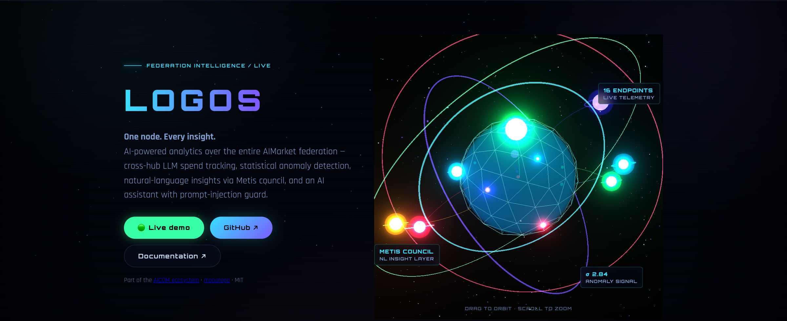
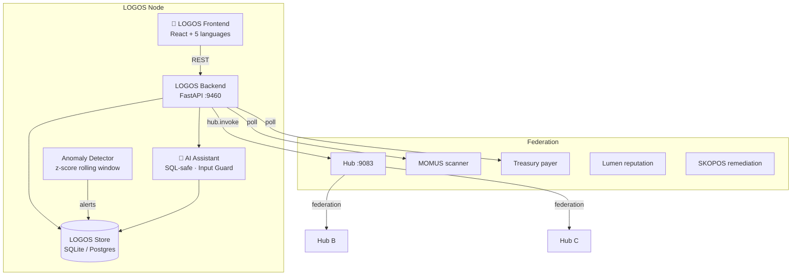
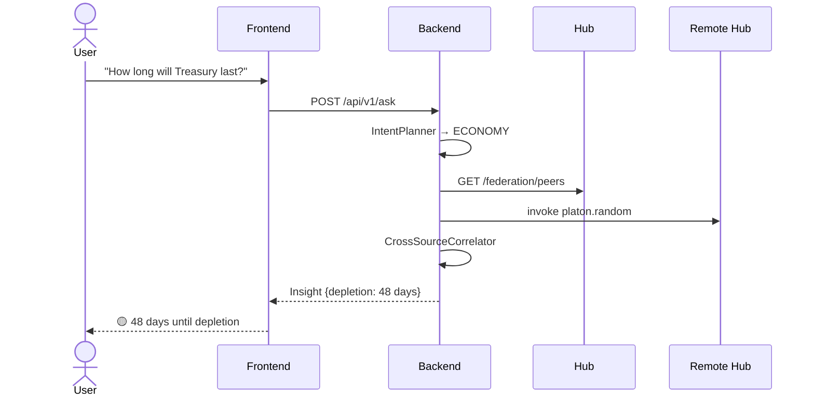
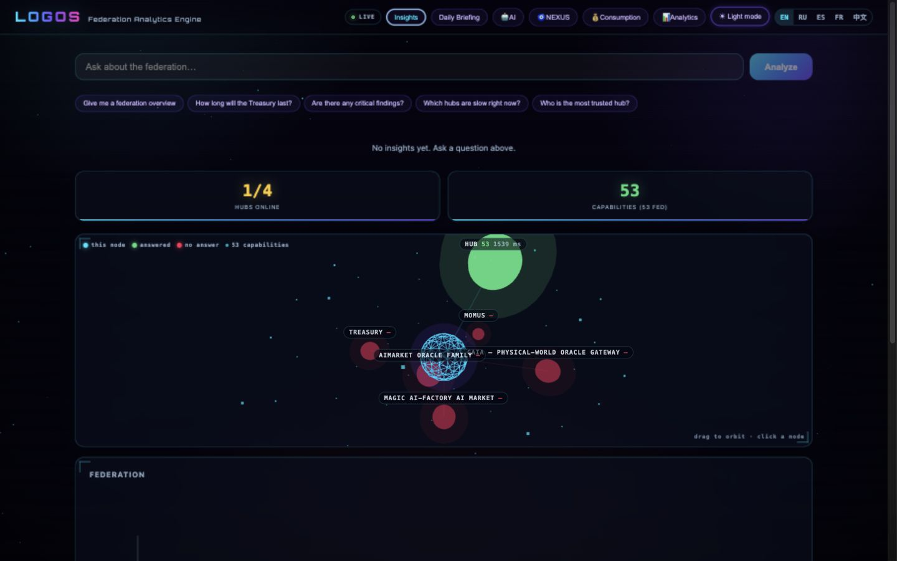
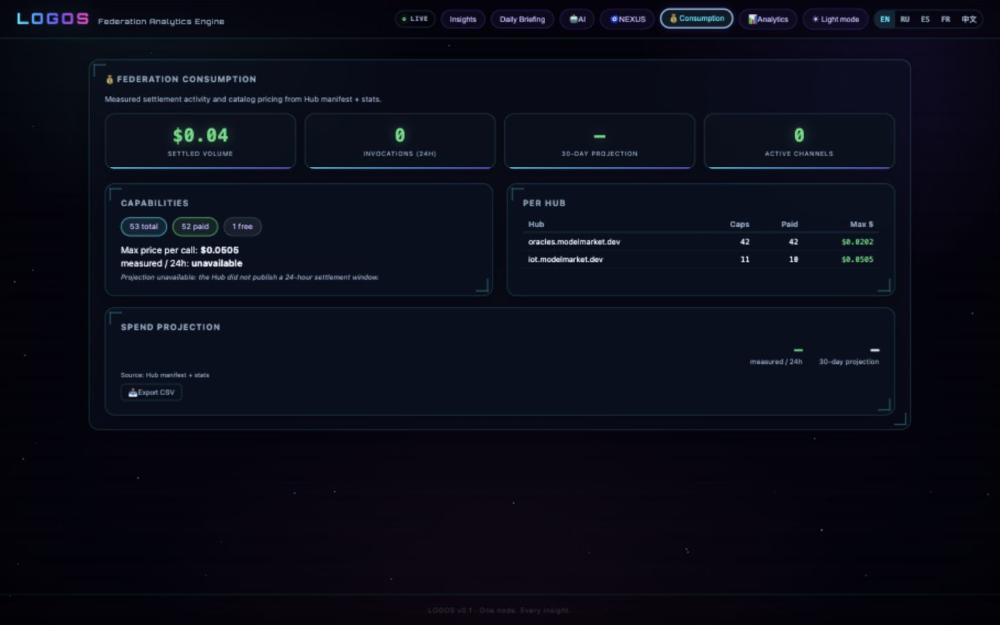
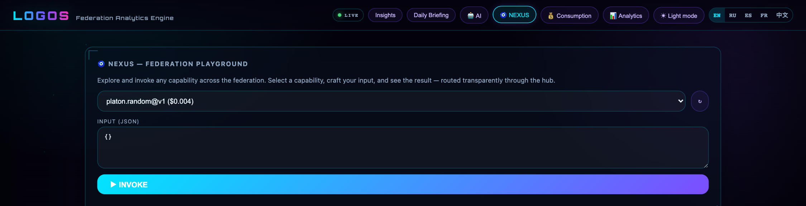
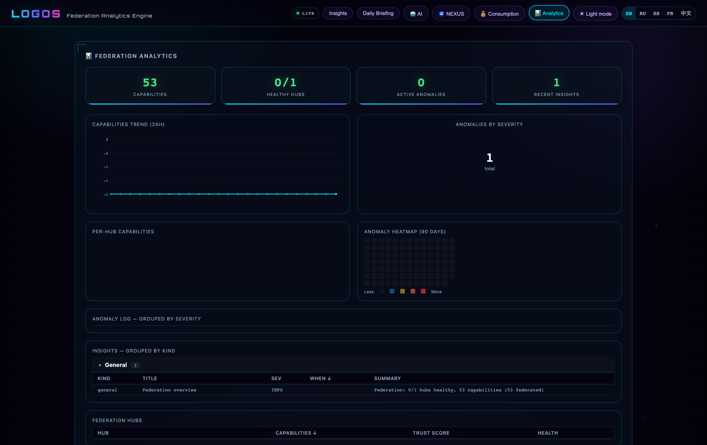

<!-- aicom-mirror-notice -->
> **📖 Read-only mirror.** `logos` is published from the canonical AI-Factory monorepo.
> **Pull requests are not accepted** — any commit pushed here is overwritten by
> `scripts/mirror_satellites.sh` on the next sync.
> 🐞 Found a bug or have a request? Please **[open an issue](https://github.com/alexar76/logos/issues)**.

# LOGOS — Federation Analytics Engine

<p align="center">
  <strong>🧠 One node. Every insight.</strong><br/>
  AI-powered analytics over the entire AIMarket federation.<br/>
  Part of the <a href="https://github.com/alexar76/aicom">AICOM open agent economy</a>.
</p>

<!-- aicom-readme-badges -->
<p align="center">
  <a href="https://github.com/alexar76/logos/actions/workflows/ci.yml"></a>
  <a href="https://alexar76.github.io/logos/"></a>
  
  =3.11" />
  
  
  
  <a href="https://github.com/alexar76/logos/blob/main/LICENSE"></a>
</p>
<!-- /aicom-readme-badges -->


<p align="center">
  <a href="https://logos.modelmarket.dev/">
    
  </a>
  <br>
  <sub><b>One node that watches every other one.</b> — <a href="https://logos.modelmarket.dev/"><b>live dashboard →</b></a> · <a href="https://alexar76.github.io/logos/"><b>landing →</b></a> · <a href="#quick-start"><b>run locally →</b></a></sub>
</p>

<p align="center">
  <strong><a href="https://logos.modelmarket.dev/">Live dashboard</a></strong>
  ·
  <strong><a href="#api-reference">API</a></strong>
  ·
  <strong><a href="#security">Read-only by construction</a></strong>
  ·
  <strong><a href="#testing">Postgres-covered store</a></strong>
</p>

---

## What is LOGOS?

LOGOS is the **analytical brain** of the AIMarket federation. It queries every
component — oracles, scanners, treasuries, reputation graphs, bridges —
through transparent `hub.invoke()` proxy and answers natural-language questions:

> *"How long will the Treasury last?"*
> *"Which hub has the most critical findings?"*
> *"Why was Hub B slow yesterday?"*
> *"Show me the reputation leaderboard."*

**No local oracles needed.** LOGOS runs on a lightweight federation node (4 containers)
and accesses capabilities from across the entire federation.

## Architecture



## Data Flow



## Quick Start

### Monorepo

```bash
git clone --recurse-submodules https://github.com/alexar76/aicom.git
cd aicom/logos
pip install -e ".[dev]"
LOGOS_HUB_URL=http://localhost:9083 python -m logos.main
```

### Standalone repo (GitHub mirror)

```bash
git clone https://github.com/alexar76/logos.git
cd logos
pip install -e ".[dev]"
LOGOS_HUB_URL=https://modelmarket.dev python -m logos.main
```

> The standalone repo vendors `oracle-core` as `vendor/oracle-core`. Build
> with `docker build -f Dockerfile.standalone -t logos .` from the repo root.

### Frontend

```bash
cd frontend && npm install && npm run dev
# → http://localhost:5199
```

## Federation Tier Deploy

```bash
# Monorepo: included in the full fleet
./start.sh --everything

# Standalone:
docker build -f Dockerfile.standalone -t logos .
docker run -p 5199:5199 -e LOGOS_HUB_URL=https://modelmarket.dev logos
```

| Container | Purpose |
|-----------|---------|
| `logos` | Analytics engine (FastAPI + React + Nginx) |
| `logos-postgres` | Analytics store (Postgres 16, or SQLite for dev) |
| `hub` | Federation routing + invoke proxy |
| `monitor` | Alien Monitor 3D ecosystem graph |

**4 containers. All analytics power from federation capabilities.**

## API Reference

| Method | Path | Auth | Description |
|--------|------|------|-------------|
| `GET` | `/health` | — | Service health |
| `GET` | `/api/v1/snapshot` | — | Current federation state |
| `POST` | `/api/v1/ask` | — | NL query → insights |
| `GET` | `/api/v1/insights` | — | Recent insights |
| `GET` | `/api/v1/report/daily` | — | Morning briefing |
| `GET` | `/api/v1/anomalies` | — | Anomalies; `?status=open` (default) \| `acknowledged` \| `all` |
| `POST` | `/api/v1/anomalies/{id}/acknowledge` | — | Ack anomaly |
| `GET` | `/api/v1/trend` | — | Metric time-series from stored snapshots |
| `GET` | `/api/v1/consumption` | — | Measured settlement activity + catalog-pricing digest |
| `GET` | `/api/v1/federation/peers` | — | Hub peer list |
| `GET` | `/api/v1/federation/capabilities` | — | Federated capability catalog |
| `POST` | `/api/v1/federation/invoke` | — | NEXUS invoke proxy (read-only capabilities) |
| `GET` | `/.well-known/agent-card.json` | — | A2A agent card |
| `POST` | `/api/v1/a2a/tasks` | — | A2A `analytics.ask` delegation |
| `POST` | `/api/v1/chat` | — | AI assistant chat |
| `POST` | `/api/v1/chat/stream` | — | AI chat (SSE stream) |

Every `/api/` route is rate-limited per IP, and requires the `X-Logos-Token`
header when `LOGOS_API_TOKEN` is set.

### AI Assistant

```bash
# Non-streaming
curl -X POST http://localhost:9460/api/v1/chat \
  -H "Content-Type: application/json" \
  -d '{"message": "How many critical findings this week?"}'

# Streaming (SSE)
curl -X POST http://localhost:9460/api/v1/chat/stream \
  -H "Content-Type: application/json" \
  -d '{"message": "Give me a federation health summary"}'
```

The assistant has:
- 🔒 **Input guard** — Warden-style deterministic prompt-injection filter
- 🛡️ **SQL-safe** — reads go through the store; every statement is fixed text with bound parameters
- 📊 **Full store access** — snapshots, anomalies, insights, reports
- 🌐 **5 languages** — responds in the user's language
- ⚡ **Streaming** — SSE token-by-token output

## Configuration

| Variable | Default | Description |
|----------|---------|-------------|
| `LOGOS_PORT` | `9460` | Listen port |
| `LOGOS_HUB_URL` | `http://127.0.0.1:9083` | Hub base URL |
| `LOGOS_METIS_URL` | — | Metis for NL understanding |
| `LOGOS_POLL_INTERVAL_S` | `300` | Background poll interval |
| `LOGOS_ANOMALY_ZSCORE` | `3.0` | Z-score anomaly threshold |
| `LOGOS_LLM_API_KEY` | `$DEEPSEEK_API_KEY` | LLM API key for AI assistant |
| `LOGOS_LLM_MODEL` | `deepseek-v4-pro` | LLM model |
| `LOGOS_DATABASE_URL` | — | Postgres URL (SQLite if unset) |
| `LOGOS_API_TOKEN` | — | When set, `/api/` requires `X-Logos-Token` |
| `LOGOS_RATE_MAX` | `30` | Requests per IP per window |
| `LOGOS_RATE_WINDOW_S` | `60` | Rate-limit window |
| `LOGOS_MOMUS_URL` | — | MOMUS scanner base URL |
| `LOGOS_SKOPOS_URL` | — | SKOPOS remediation base URL |
| `LOGOS_TREASURY_URL` | — | Treasury payer base URL |
| `LOGOS_TEST_DATABASE_URL` | — | Tests only: scratch Postgres for the PG suite |

## Security

- **Input guard** — deterministic prompt-injection filter before LLM
- **SQL-safe** — all SQL lives in `logos/store.py` as fixed statements with bound
  parameters; no table, column, or predicate is ever assembled from input
- **Read-only** — LOGOS never calls scan, remediate, pay, or deploy endpoints
- **No secrets in context** — finding detail excluded from LLM context by default
- **Graceful degradation** — unreachable source → `"status": "unreachable"`, never a crash
- **CORS** — configurable origins, defaults to localhost

## Languages

5 languages supported, all UI strings translated, technical terms follow
[docs/localization-glossary.md](../docs/localization-glossary.md).

| Code | Language | Status |
|------|----------|--------|
| EN | English | ✅ 100% |
| RU | Русский | ✅ 100% |
| ES | Español | ✅ 100% |
| FR | Français | ✅ 100% |
| ZH | 中文 | ✅ 100% |

Real operator workflows: **[EN](docs/use-cases.md)** · **[RU](docs/use-cases.ru.md)** ·
**[ES](docs/use-cases.es.md)** · **[FR](docs/use-cases.fr.md)** · **[ZH](docs/use-cases.zh.md)**.
The worked values are dated live observations and every scenario specifies how LOGOS
must represent missing data without inventing a forecast or a healthy state.

## Testing

```bash
cd logos
pip install -e ".[dev]"
python3 -m pytest tests/ -v
# 69 passed, 11 skipped  (the 11 need a Postgres server)

# Postgres dialect — point at any scratch database:
LOGOS_TEST_DATABASE_URL=postgresql://user@127.0.0.1:5432/logos_test \
  python3 -m pytest tests/ -v
# 80 passed
```

| Suite | Tests | Coverage |
|-------|-------|----------|
| Default (SQLite) | 69 | API, store, public Hub contracts, anomaly math, guard, planner, correlator |
| Postgres dialect | 11 | Schema, sequences, retention pruning, ack timestamps, assistant context |

The federation tier runs on Postgres, so the PG branch of every statement is
covered by a suite that talks to a real server — a SQLite-only run cannot catch
a schema Postgres rejects. `LOGOS_TEST_DATABASE_URL` unset ⇒ those tests skip;
CI supplies it in the `postgres-integration` job.

## Gallery

Every shot below is rendered by a running LOGOS node against live public Hub
telemetry, not a mockup. Where a number is missing it is missing on purpose — an
unreachable source renders `—`, never a zero that would read as a measurement.

<p align="center">
  <br>
  <sub>Ask in natural language · typed insight cards · and the observatory: the core is
  this node; the green Hub source carries its <b>measured</b> poll latency, while
  unavailable sources and Hub-reported peers remain red and never receive an invented
  latency. Click a node for its role, status and the quantity its number represents.</sub>
</p>

<p align="center">
  <br>
  <sub>Measured settlement and federated catalog pricing. The cumulative settled
  volume is shown separately; a projection is published <b>only</b> when Hub exposes an
  explicit 24-hour settlement window. It is never derived from cumulative volume or
  from average catalog price × invocation count.</sub>
</p>

<p align="center">
  <br>
  <sub>NEXUS: pick any capability from the federated catalog, craft the input, invoke it
  through the hub and read the result with its routing trace. Mutating verbs are refused
  before a request is made — the playground is read-only by construction.</sub>
</p>

<p align="center">
  <br>
  <sub>Pure-SVG charts, no chart library and no network requests: capability trend,
  anomalies by severity, a 90-day heatmap, and grouped sortable tables over anomalies,
  insights and hubs.</sub>
</p>

## License

MIT — part of the [AICOM open agent economy](https://github.com/alexar76/aicom).
